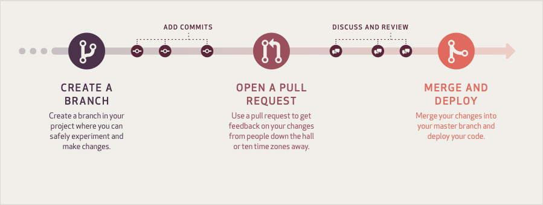

# Contributing

👍🎉 First off, thank you for taking the time to contribute! 🎉👍

> ⚠️ If you are just looking for help, see [support](SUPPORT.md)

The following is a set of guidelines for contributing to {{ cookiecutter.project_name }}.
These are mostly guidelines, not rules. Use your best judgment, and feel free to propose changes to this document in a pull request.

Please note we have a [code of conduct](CODE_OF_CONDUCT.md), please follow it in all your interactions with {{ cookiecutter.project_name }}.

## Many ways to contribute

1. [Spread the Word](#spread-the-word)
2. [Report Bugs](#report-bugs)
3. [Resolve Issues](#resolve-issues)
4. [Improve the Documentation](#improve-the-documentation)

### Spread the Word

If you like {{ cookiecutter.project_name }}, you can bring it up in a conversation at the coffee machine with your colleagues, on an internet forum, Reddit, Quora, Linkedin, etc.

If you own a blog or are thinking of starting one, {{ cookiecutter.project_name }} and how you use it might be a good subject for an article.

If you are using {{ cookiecutter.project_name }} in one way or another, credits are always welcome.

### Report Bugs

If you found a bug or want to propose a new feature, thank you for taking the time to report it 🙏
To do so, just 
[open an issue](https://github.com/{{ cookiecutter.vcs_path }}/issues)

[open an issue](https://{{ cookiecutter.vcs_gitlab_url }}/{{ cookiecutter.vcs_path }}/issues)

[open an issue](https://{{ cookiecutter.vcs_bitbucket_url }}/{{ cookiecutter.vcs_path }}/issues?status=new&status=open)

[open an issue](https://{{ cookiecutter.vcs_gogs_url }}/{{ cookiecutter.vcs_path }}/issues)

[open an issue](https://{{ cookiecutter.vcs_gitea_url }}/{{ cookiecutter.vcs_path }}/issues)

and give as much information as you can about the bug you found and how to reproduce it.

If you know this is a quick fix, you can apply the labels `good first issue` and `easy` so programmers new to {{ cookiecutter.project_name }} can find it easily to resolve it.

> ⚠️ If you found a vulnerability, please see [our security policy](SECURITY.md)

### Resolve Issues

If you are new to {{ cookiecutter.project_name }} and are not sure where to start, we recommend that you look for

issues labelled [good first issue](https://github.com/{{ cookiecutter.vcs_path }}/labels/good first issue) or [easy](https://github.com/{{ cookiecutter.vcs_path }}/labels/easy)

issues labelled [good first issue](https://{{ cookiecutter.vcs_gitlab_url }}/{{ cookiecutter.vcs_path }}/issues?scope=all&utf8=✓&state=opened&label_name[]=good first issue) or [easy](https://{{ cookiecutter.vcs_gitlab_url }}/{{ cookiecutter.vcs_path }}/issues?scope=all&utf8=✓&state=opened&label_name[]=easy)

[existing issues](https://{{ cookiecutter.vcs_bitbucket_url }}/{{ cookiecutter.vcs_path }}/issues?status=new&status=open)

[existing issues](https://{{ cookiecutter.vcs_gogs_url }}/{{ cookiecutter.vcs_path }}/issues)

[existing issues](https://{{ cookiecutter.vcs_gitea_url }}/{{ cookiecutter.vcs_path }}/issues)


Before coding your pulll request, please first discuss the change you wish to make by commenting on an existing issue or by 
[opening an issue](https://github.com/{{ cookiecutter.vcs_path }}/issues)

[opening an issue](https://{{ cookiecutter.vcs_gitlab_url }}/{{ cookiecutter.vcs_path }}/issues)

[opening an issue](https://{{ cookiecutter.vcs_bitbucket_url }}/{{ cookiecutter.vcs_path }}/issues?status=new&status=open)

[opening an issue](https://{{ cookiecutter.vcs_gogs_url }}/{{ cookiecutter.vcs_path }}/issues)

[opening an issue](https://{{ cookiecutter.vcs_gitea_url }}/{{ cookiecutter.vcs_path }}/issues)

.

#### Pull Request Process

We follow the [GitHub Flow](https://guides.github.com/introduction/flow/).

[](https://guides.github.com/pdfs/githubflow-online.pdf)

Here is the process:

1. 
[Fork](https://github.com/{{ cookiecutter.vcs_path }}/fork)

[Fork](https://{{ cookiecutter.vcs_gitlab_url }}/{{ cookiecutter.vcs_path }}/-/forks/new)

[Fork](https://{{ cookiecutter.vcs_bitbucket_url }}/{{ cookiecutter.vcs_path }}/fork)

Fork

 {{ cookiecutter.project_name }}

2. Clone **your** fork on your development machine

3. Most of the time, you will want to create a branch off the `master` branch which should be checked out by default, you can ensure it by running:

   ```sh
   git checkout master
   ```

4. Create a branch named after the feature you're working on

   ```sh
   git checkout -b <branch_name>
   ```

5. Write code and tests for your change then commit them to your branch and push them to your repo.

   ```sh
   git add .
   git commit
   git push origin <branch_name>
   ```

   > How to write a descriptive commit message:
   > - Describe what was done; not the result
   > - Use the active voice
   > - Use the present tense
   > - Capitalize properly
   > - Do not end in a period — this is a title/subject
   > - Prefix the subject with its scope

6. Open a pull request
   
   [against {{ cookiecutter.project_name }}](https://github.com/{{ cookiecutter.vcs_path }}/compare/master)
   
   [against {{ cookiecutter.project_name }}](https://{{ cookiecutter.vcs_gitlab_url }}/{{ cookiecutter.vcs_path }}/-/merge_requests/new)
   
   [against {{ cookiecutter.project_name }}](https://{{ cookiecutter.vcs_bitbucket_url }}/{{ cookiecutter.vcs_path }}/pull-requests/new)
   
   [against {{ cookiecutter.project_name }}](https://{{ cookiecutter.vcs_gogs_url }}/{{ cookiecutter.vcs_path }}/compare/master...master)
   
   [against {{ cookiecutter.project_name }}](https://{{ cookiecutter.vcs_gitea_url }}/{{ cookiecutter.vcs_path }}/compare/master...master)
   

7. Work with the
   
   [project maintainer(s)](https://github.com/{{ cookiecutter.vcs_path }}/graphs/contributors)
   
   [project maintainer(s)](https://{{ cookiecutter.vcs_gitlab_url }}/{{ cookiecutter.vcs_path }}/-/graphs/master)
   
   [project maintainer(s)](https://{{ cookiecutter.vcs_bitbucket_url }}/{{ cookiecutter.vcs_path }}/commits/branch/master)
   
   [project maintainer(s)](https://{{ cookiecutter.vcs_gogs_url }}/{{ cookiecutter.vcs_path }}/commits/master)
   
   [project maintainer(s)](https://{{ cookiecutter.vcs_gitea_url }}/{{ cookiecutter.vcs_path }}/commits/branch/master)
   
   to get your pull request reviewed

8. Wait for your pull request to be merged and watch it to answer any questions or make any changes you're asked. You will make these modifications directly on your feature branch.

9. Once it is merged, you can delete your feature branch

   ```sh
   git branch -d <branch_name>
   git push origin --delete <branch_name>
   ```

### Improve the Documentation

We also welcome improvements to the documentation of {{ cookiecutter.project_name }}. If you want to fix a typo, add a sentence or two, an example, etc. we recommend that you open a [pull request](#pull-request-process) directly. For bigger changes to the documentation, we recommend to [discuss it in an issue](#report-bugs) before spending any time making huge changes that could be rejected.

## License

By contributing your code, you agree to license your contribution under the
terms of our 
[{{ cookiecutter.license }} license](https://github.com/{{ cookiecutter.vcs_path }}/blob/master/LICENSE)

[{{ cookiecutter.license }} license](https://{{ cookiecutter.vcs_gitlab_url }}/{{ cookiecutter.vcs_path }}/-/blob/master/LICENSE)

[{{ cookiecutter.license }} license](https://{{ cookiecutter.vcs_bitbucket_url }}/{{ cookiecutter.vcs_path }}/src/master/LICENSE)

[{{ cookiecutter.license }} license](https://{{ cookiecutter.vcs_gogs_url }}/{{ cookiecutter.vcs_path }}/src/master/LICENSE)

[{{ cookiecutter.license }} license](https://{{ cookiecutter.vcs_gitea_url }}/{{ cookiecutter.vcs_path }}/src/branch/master/LICENSE)


## Code of Conduct

Read our [Code of Conduct](CODE_OF_CONDUCT.md) for {{ cookiecutter.project_name }}.
